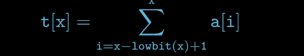

## 树状数组和线段树
### 一、树状数组 -> 用来解决动态前缀和的数据结构

数组： [a1, a2, a3, a4, ..., an]
询问： 前缀和：a1+a2+a3+a4+am
修改： ai(1<=i<=n)的值
问题的引入就是有一个数组arr，这个数组arr长度很大，属于大数据行列。然后，我们对这个arr数组主要的
操作集中在 （1）查询（query）arr数组中某一区间的和；
         （2）更新（update）arr数组中某一索引的值
如果就用数组结构的话，我们可以很容易得到上述操作的时间复杂度：query操作的时间复杂度是O(N)，update操作
时间复杂度是O(1)。那么如果我们想改进这两个操作的时间复杂度怎么做呢？
arr     = [1, 2, 3, 4, 5, 6]     
new_arr = [1, 3, 6, 10, 15, 21]
我们把new_arr数组中元素的含义改成前i项和，这样query操作时间复杂度就是O(1)了，但是update的操作复杂度
又变成了O(n)。这就尴尬了。最后的复杂度还是没有优化。
所以，引入了线段树和树状数组的数据结构概念，将上述操作复杂度进化到O(logn)操作了。


### 概念引入
线段树是一种二叉树，也就是对于一个线段，我们会用一个二叉树来表示。比如说一个长度为4的数组，如果你要表示线段的和，
那么最上面的根节点的权值表示的是这个线段1~4的和。根的两个儿子分别表示这个线段中1~2的和，与3~4的和。以此类推。
然后我们还可以的到一个性质：节点i的权值=她的左儿子权值+她的右儿子权值。因为1~4的和就是等于1~2的和+2~3的和。

根据这个思路，我们就可以建树了，我们设一个结构体tree，tree[i].l和tree[i].r分别表示这个点代表的线段的左右下标，
tree[i].sum表示这个节点表示的线段和。

我们知道，一颗二叉树，她的左儿子和右儿子编号分别是她*2+1和她*2+2
再根据刚才的性质，得到式子：tree[i].sum=tree[i*2+1].sum+tree[i*2+2].sum;就可以建一颗线段树了！
我们还是借鉴一道LeetCode的题目来看吧。

problem_307.区域和检索-数组可修改
给定一个整数数组  nums，求出数组从索引 i 到 j  (i ≤ j) 范围内元素的总和，包含 i,  j 两点。

update(i, val) 函数可以通过将下标为 i 的数值更新为 val，从而对数列进行修改。

示例:

Given nums = [1, 3, 5]

sumRange(0, 2) -> 9
update(1, 2)
sumRange(0, 2) -> 8
说明:

数组仅可以在 update 函数下进行修改。
你可以假设 update 函数与 sumRange 函数的调用次数是均匀分布的。

来源：力扣（LeetCode）
链接：https://leetcode-cn.com/problems/range-sum-query-mutable
著作权归领扣网络所有。商业转载请联系官方授权，非商业转载请注明出处。

    那么这道题明显就是根据线段树和树型数组来出的，考的也就是线段树或者是树型数组的创建以及两个具体操作的实现
    那么这个线段树是怎么建立起来的呢，可以根据上面的图片大致推断出来，根节点存储的是整个数组的总和，然后左右子节点
    分别存储前一半和后一半的数组的和，依次递归分布下去就可以了。
    通过线段树，我们的query和update操作的时间复杂度都是O(logn)
```
from typing import List


class SegmentTree:
    def __init__(self, arr, merge):
        '''
        arr: 传入的数组
        merge: 处理的业务逻辑，例如求和/最大值/最小值，lambda表达式
        '''
        self.arr = arr
        self.n = len(arr)
        # 申请4倍arr长度的空间来存储线段树的节点，
        self.tree = [None] * (4 * self.n)
        # 索引i的左孩子索引为2*i+1，右孩子索引为2*i+2
        self._merge = merge
        if self.n:
            self._build(0, 0, self.n - 1)

    def query(self, ql, qr):
        '''
        返回区间[ql,...,qr]的值
        '''
        return self._query(0, 0, self.n - 1, ql, qr)

    def update(self, index, value):
        # 将arr数组index位置的值更新为value，然后递归更新线段树中被影响的各节点的值
        self.arr[index] = value
        self._update(0, 0, self.n - 1, index)

    def _build(self, tree_index, l, r):
        '''
        递归创建线段树
        :param tree_index: 线段树节点在数组中位置
        :param l: 该节点表示的区间的左边界
        :param r: 该节点表示的区间的右边界
        '''
        if l == r:
            self.tree[tree_index] = self.arr[l]
            return
        mid = (l + r) // 2  # 区间中点，对应左孩子区间结束后，右孩子区间开头
        left, right = 2 * tree_index + 1, 2 * tree_index + 2  # tree_index的左右子树索引
        self._build(left, l, mid)
        self._build(right, mid + 1, r)
        self.tree[tree_index] = self._merge(self.tree[left], self.tree[right])

    def _query(self, tree_index, l, r, ql, qr):
        '''
        递归查询区间[ql,..,qr]的值
        tree_index : 某个根节点的索引
        l, r : 该节点表示的区间的左右边界
        ql, qr: 待查询区间的左右边界
        '''
        if l == ql and r == qr:
            return self.tree[tree_index]

        mid = (l + r) // 2  # 区间中点,对应左孩子区间结束,右孩子区间开头
        left, right = tree_index * 2 + 1, tree_index * 2 + 2
        if qr <= mid:
            # 查询区间全在左子树
            return self._query(left, l, mid, ql, qr)
        elif ql > mid:
            # 查询区间全在右子树
            return self._query(right, mid + 1, r, ql, qr)

        # 查询区间一部分在左子树一部分在右子树
        return self._merge(self._query(left, l, mid, ql, mid),
                           self._query(right, mid + 1, r, mid + 1, qr))

    def _update(self, tree_index, l, r, index):
        '''
        tree_index:某个根节点索引
        l, r : 此根节点代表区间的左右边界
        index : 更新的值的索引
        '''
        if l == r == index:
            self.tree[tree_index] = self.arr[index]
            return
        mid = (l + r) // 2
        left, right = 2 * tree_index + 1, 2 * tree_index + 2
        if index > mid:
            # 要更新的区间在右子树
            self._update(right, mid + 1, r, index)
        else:
            # 要更新的区间在左子树index<=mid
            self._update(left, l, mid, index)
        # 里面的小区间变化了，包裹的大区间也要更新
        self.tree[tree_index] = self._merge(self.tree[left], self.tree[right])


class NumArray:

    def __init__(self, nums: List[int]):
            self.segment_tree = SegmentTree(nums, lambda x, y: x + y)

    def update(self, i: int, val: int) -> None:
            self.segment_tree.update(i, val)

    def sumRange(self, i: int, j: int) -> int:
            return self.segment_tree.query(i, j)
```
上面的代码写的很模板，因为 **线段树**  用于解决多种范围查询的问题，比如在对数时间内从数组中找到最小值、最大值、
总和、最大公约数、最小公倍数。 

### 二、树状数组
树状数组和线段树差不多，但是功能比线段树少，树状数组能解决的问题，线段树都可以解决，反过来就不一定可以。但是树状数组
更省一点空间。对于一个数组序列的单点修改和区间查询，树状数组已经完全可以解决问题，不一定需要用线段树来做。

了解树状数组需要知道 lowbit()操作。
lowbit()运算表示非负整数n在二进制表示下最低位1和后面的0构成的十进制数值
比如 lowbit(44) = lowbit((101100)) = (100) = 4  (用括号括起来表示的是二进制)
那么怎么简单计算一个数值的lowbit结果呢？

    我们可以将这个数转成二进制，然后按位取反，末位加1，然后将两个二进制数按位与运算，最后得到的二进制数转换为十进制数就是x的lowbit运算结果啦
    比如：
        44 = （101100） ->按位取反，末位加1-> (010100)
        前后两个二进制数分别为：
                101100
                010100
                将这两个二进制数进行按位与运算，得到的结果就是
                000100 ->转成十进制就是 4
                那么lowbit(44)=4
        现在关键的简化部分来了：计算机存储数字用的是补码的方式：
        所以  一个数取反+1 之后得到的就是这个数的负数
        那么原来求一个数的lowbit结果是原二进制数和取反+1进行与运算
        现在就转换为 原数和其负数相与即可。
            lowbit(n) = n & (~n+1)
                      = n & -n

对于一个序列，我们在其上建立一个这样的树结构                      
 

每个节点t[x]保存以x为跟的子树中叶节点值的和，那么每个节点覆盖的区间长度是多少呢
把每个节点t[x]的x转化为二进制后，我们发现每一层的末尾0的个数都是相同的，                  
 

进一步观察，我们发现t[x]节点覆盖的长度就是lowbit(x),继续观察，我们还会发现，t[x]节点的父节点为
t[x+lowbit(x)],
  
          


接下来，我们就考虑如何在这个结构上来进行add(index,value),ask(index)
    
    add(index,value）操作是在原数组上将A[index]值加上value
    那么从叶节点开始逐步向上(+lowbit)，逐个更新父节点的值直到整棵树的根节点
  
    
    ask(index)操作是查询原数组A的前缀和即从A[1]到A[index]和
   

   
        
    
       
        
    
    